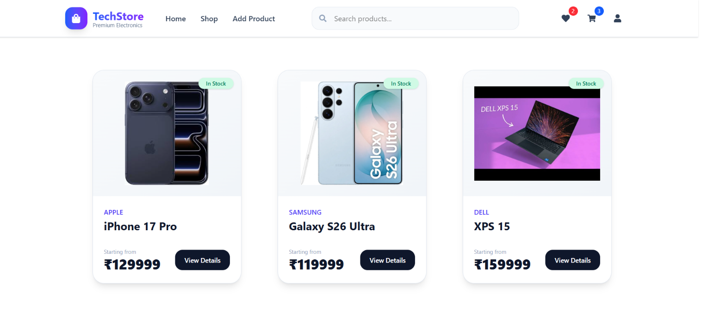
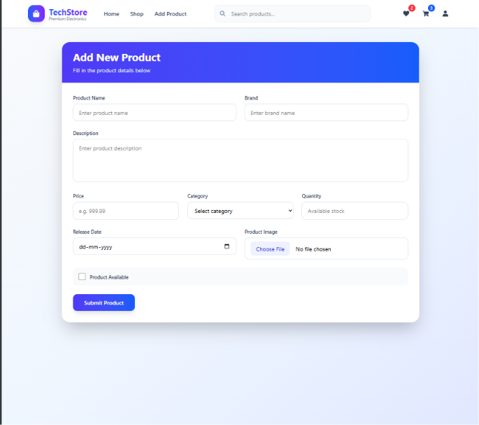
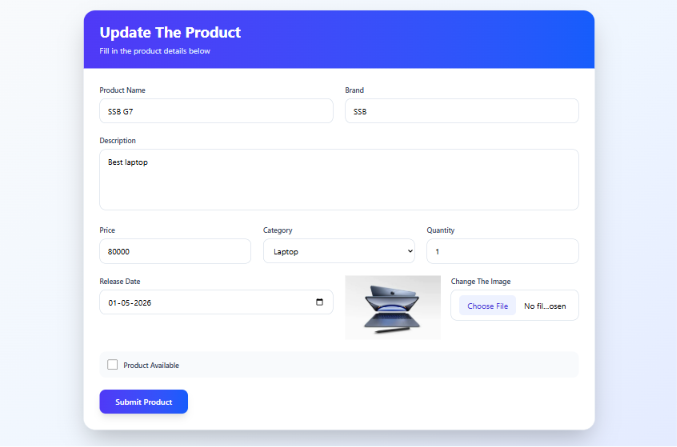
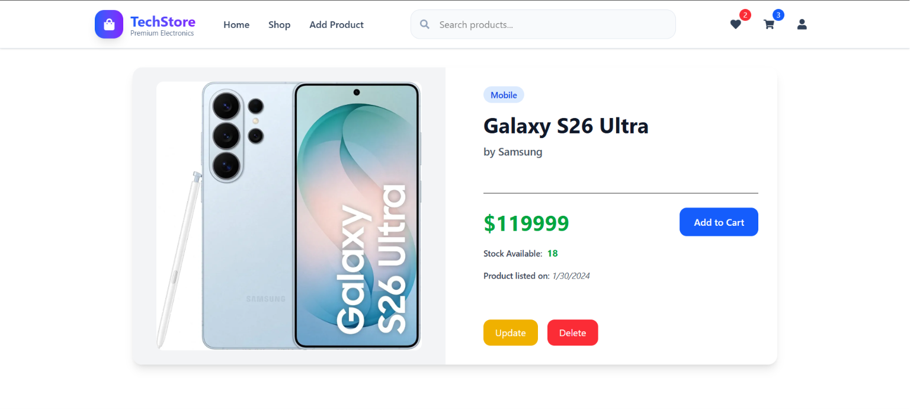

# 🛒 TechStore - E-Commerce Web Application

A full-stack e-commerce web application developed using **React** and **Spring Boot** as a backend learning project. This application allows users to manage products through CRUD operations and demonstrates REST API integration between the frontend and backend.

> ⚠️ This project was developed for learning purposes. Some advanced e-commerce features such as shopping cart, and order management are not yet implemented.

---

## 🚀 Features

- 📦 View all products
- ➕ Add new products
- ✏️ Update existing products
- 🗑️ Delete products
- 🔍 Search products
- 🖼️ Upload product images
- 📄 Product details page
- 🔄 REST API integration
- 📱 Responsive user interface

---

## 🛠️ Tech Stack

### Frontend
- React.js
- JavaScript (ES6+)
- HTML5
- CSS3
- TailwindCss

### Backend
- Spring Boot
- Spring Web
- Spring Data JPA
- Hibernate

### Database
- MySQL

### Build Tools
- Maven
- npm

---

## 📂 Project Structure

```
TechStore/
│
├── frontend/          # React Application
│
├── backend/           # Spring Boot Application
│
└── README.md
```

---

## ⚙️ Installation

### Clone the repository

```bash
git clone https://github.com/your-username/TechStore.git
```

### Backend

```bash
cd backend
```

Configure MySQL in:

```
application.properties
```

Run the Spring Boot application.

---

### Frontend

```bash
cd frontend
npm install
npm start
```

The application will start at:

```
http://localhost:3000
```

---

## 📚 What I Learned

- Building REST APIs using Spring Boot
- React Component Architecture
- CRUD Operations
- React Hooks
- Axios API Calls
- MySQL Database Integration
- File/Image Upload
- State Management
- Backend-Frontend Communication

---

## ⚠️ Current Limitations

- No Shopping Cart
- No Wishlist
- No Checkout Process
- No Payment Gateway
- No Order History
- No Admin Dashboard
- Product management is accessible without login

---

## 🔮 Future Improvements

- Admin Dashboard
- Shopping Cart
- Wishlist
- Order Management
- Payment Gateway Integration
- Product Categories
- Product Reviews & Ratings
- Email Notifications
- Docker Deployment
- Cloud Deployment (AWS/Render)

---

## 📸 Screenshots

Add screenshots of:

- Home Page


- Add Product

- Update Product

- Product Details



---

## 👨‍💻 Author

**Sudhangsu Shekhar Bairagi**

MCA Student | Aspiring Full-Stack Java Developer

---

⭐ If you like this project, consider giving it a star!#